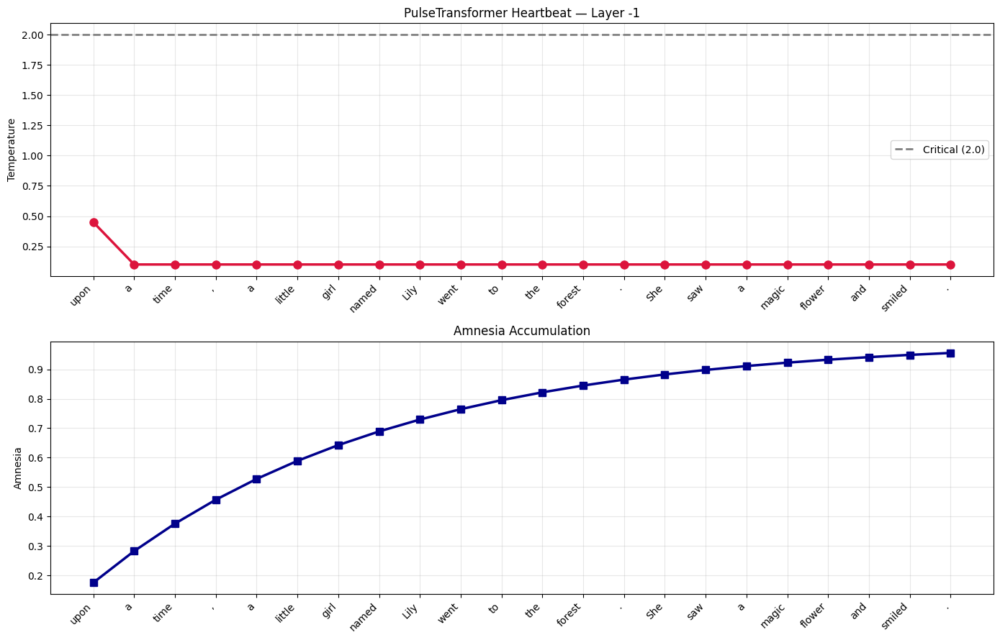

# 🌡️ Eulerian Homeostatic Transformer

*Эксперимент по замкнутому гомеостатическому регулированию и динамическим фазовым переходам в слоях трансформера.*

## 📌 Обзор
**Eulerian Homeostatic Transformer** рассматривает латентное пространство как **динамический поток (dynamical flow)**, регулируемый контуром обратной связи (симуляция биологического торможения и вязкости).

---

## 🧬 Ключевые механизмы (Core Architecture)

### 1. Эйлеров вихревой поток (Eulerian Vortex Memory)
Контекст формирует виртуальный вихрь, где траектория зависит от информационного давления (\(info\_pressure\)), основанного на косинусном сходстве.

### 2. Динамический гомеостатический контур
Регулирует амплитуду сигнала (\(x\)) для поддержания целевой температуры (\(\tau_{target}\)):
\(x_{modulated} = x \cdot \exp\left(\frac{\tau_{target} - \tau}{\lambda}\right)\)

- **Недогрузка (\(\tau < \tau_{target}\)):** Ампличфикация сигнала.
- **Равновесие (\(\tau = \tau_{target}\)):** Стабильный поток.
- **Перегрев (\(\tau > \tau_{target}\)):** Синаптическое торможение (защита от энтропийного взрыва).

---

## 📊 Результаты тестов (TinyStories)

### 1. Сравнительный анализ генерации

| Модель | Diversity ↑ | Repeat ↓ | Verbs ↑ | LM Loss ↓ |
| :--- | :---: | :---: | :---: | :---: |
| **Standard** | 0.750 | 0.023 | 9 | 6.203 |
| **Homeostatic** | **0.762** | 0.024 | **11** | **2.928** |

### 2. Внутренняя динамика
Верхний слой стабилизировался в диапазоне **0.26 - 0.32**, предотвращая тепловой коллапс.

---

## 💓 Графики: Heartbeat & Amnesia



- **Heartbeat:** Информационная нагрузка; стабилизация вдали от критической линии (2.0).
- **Amnesia Accumulation:** Динамическое отсечение старого контекста.

---

## 🧪 Эксперимент: Qwen2.5

Тест на экстремальные нагрузки (Затравка: *"The dark hall was completely empty. Dust"*).

| Режим | Температура (\(t\)) | % Глаголов | Поведение потока |
| :--- | :---: | :---: | :--- |
| **Контроль** | 0.7 | 17.8% | Связный нарратив. |
| **Пик** | 1.9 | **20.3%** | Максимальное возбуждение. |
| **Торможение**| 2.5 | 16.7% | Переход в шаблон (охранительное торможение). |

---

## 🛠️ Спецификация кода
При `batch_size > 1` использовать только тензорные операции (без `.item()`) для сохранения графа градиентов:
```python
amnesia_gate = torch.sigmoid((tau - self.critical_temp) / 0.1)
```

## 📚 Цитата (Citation)
```bibtex
@misc{eulerianhomeostatic2026,
  author = {runowerum-create},
  title = {Eulerian Homeostatic Transformer: An experiment with closed-loop fluid dynamics in LLM},
  year = {2026},
  note = {GitHub repository}
}
```
